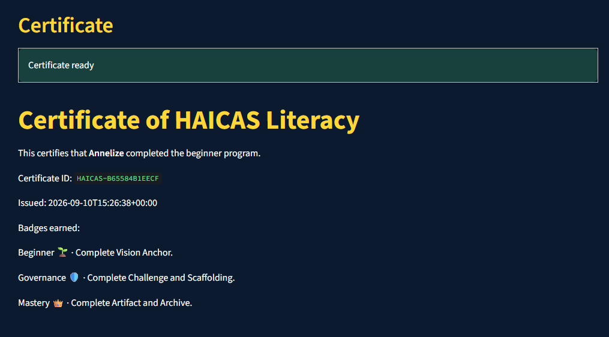

# HAICAS Tutor

## HAICAS Tutor - Beginner Demo 🌱

This repository contains a **demo version** of the HAICAS Tutor app.

- Currently, it only includes the **Beginner Workshop** lessons:
	- Introduction → Vision → Challenge → Scaffolding → Artifact → Archive
- An updated Beginner Quiz is tied to these lessons.
- The Certificate and 🌱 Beginner badge unlock after completing the beginner path.
- The **Governance 🛡️** and **Mastery 👑** paths are visible in the app but marked as *coming soon*.
- The goal of this demo is to showcase how HAICAS rituals can teach **AI literacy and governance basics** to beginners.

### Why only Beginner?

This demo was built for hackathon purposes and focuses on the **beginner course**.
Future versions will expand to include Governance and Mastery tracks.

## License

Copyright © 2026 Annelize Wide.
All rights reserved.
This software is proprietary and may not be copied, modified, or distributed without explicit permission.

## Challenge

**AI Adoption / Governance**

## Problem

AI adoption is high but shallow.

- Stanford's 2026 AI Index reports that 88% of organizations have adopted AI, yet actual agent deployment across business functions remains in the single digits.
- Traditional software shows its purpose: spreadsheets expose formulas and CRMs expose contacts. AI tools often present only a blank box. Unless people know what to ask, much of the capability sta[...]
- Customers try AI for simple tasks such as rewriting emails or summarizing documents, then stop. They rarely explore deeper workflows while managing their day-to-day work.
- Assuming customers will simply "figure it out" leaves value untapped and creates compliance risks.

## Users

HAICAS Tutor is for professionals and teams adopting AI in real workflows. They need education embedded into the product so they can learn to use AI responsibly, rather than experiment blindly.

## Solution

HAICAS Tutor is an AI-for-learning copilot that teaches Human-AI Co-Assistance Skills through a five-step ritual:

**Vision → Challenge → Scaffolding → Artifact → Archive**

- Learners produce traceable, auditable outputs called **Artifacts of Trust**.
- Glossary cards and explainers bridge the education gap around Responsible AI, bias, hallucinations, privacy, and lineage.
- A pre-course questionnaire adapts the learning path to learner concerns and skill level.
- Badges and certificates recognize literacy, governance habits, and completion.

## What is included

- Anonymous-friendly learner profile and pre-course questionnaire
- Adaptive starting recommendation based on learner concerns
- Beginner Workshop lessons covering Introduction, Vision, Challenge, Scaffolding, Artifact, and Archive
- One five-question Beginner Quiz tied to the workshop lessons
- Hugging Face AI generation for scaffolds, contradiction checks, structured notes, artifacts, archive tags, and adaptive quiz questions
- SQLite persistence for users, questionnaire responses, artifacts, quiz results, badges, and certificates
- 🌱 Beginner badge and Literacy Certificate eligibility after the Beginner Quiz is passed
- Governance 🛡️ and Mastery 👑 paths displayed as coming soon
- Personal archive with lineage and trust notes

## Architecture

- **Frontend:** Streamlit app written in Python
- **Backend:** SQLite persistence for artifacts, quiz results, badges, and certificates
- **Entry point:** `streamlit_app.py` launches `src/app.py`
- **Modules:**
	- `app.py` handles the landing page, navigation, lessons, glossary, archive, and certificate view.
	 	- `ai_integration.py` loads the configured Hugging Face text-generation model on demand and provides adaptive quiz fallback behavior.
	- `chatbot_flow.py` retains the original lesson scoring helpers.
	- `badge_system.py` unlocks the 🌱, 🛡️, and 👑 badges.
	- `certificate_generator.py` creates certificate IDs and checks completion eligibility.
	- `archive_manager.py` saves artifacts with lineage and trust notes.
	- `questionnaire.py` captures fears, skill level, and trust perception, then recommends a starting path.
	- `glossary.py` provides Responsible AI definitions, examples, and reflection questions.
	- `database.py` owns the SQLite schema and persistence functions.
	- `src/tests/` contains unit tests for quiz scoring, badges, and certificate IDs.
- **Static assets:** Badge icons and certificate templates can be added under `static/badges/` and `static/certificates/` as the visual certificate system develops.

## Setup

### Add the logo

Place the logo image at `static/haicastutorlogo.png`. The app will display it automatically on the home page.

The `static/` directory is included in the repository as the upload location for the logo and future visual assets.

### Clone the repository

```bash
git clone https://github.com/yourname/haicas-tutor.git
cd haicas-tutor
```

Replace the placeholder repository URL with the URL of your GitHub repository.

### Install dependencies

Prerequisites: Python 3.14+ and `uv`.

```bash
uv sync
```

You can also install the runtime dependency with `pip`:

```bash
pip install -r requirements.txt
```

The default AI provider is local Ollama with the instruction-following `qwen2.5:7b-instruct` model. No hosted API or API key is required. Install Ollama, then download and run the model:

```bash
ollama run qwen2.5:7b-instruct
```

You can use Llama instead:

```bash
ollama run llama2:7b-chat
export OLLAMA_MODEL=llama2:7b-chat
```

The app calls Ollama at `http://localhost:11434`. Set `OLLAMA_URL` to use another endpoint. A structured fallback keeps the demo usable when Ollama is unavailable.

Hugging Face remains available as an explicit compatibility provider:

```bash
export HAICAS_AI_PROVIDER=huggingface
```

For CPU-only environments, install PyTorch from the CPU wheel index:

```bash
uv pip install --index-url https://download.pytorch.org/whl/cpu torch
```

### Run the app

```bash
uv run streamlit run streamlit_app.py
```

When using the `pip` workflow, run:

```bash
streamlit run streamlit_app.py
```

The app creates `haicas_tutor.db` on first run. This local database is ignored by Git.

### Run the tests

```bash
uv run pytest
```

## Repository layout

```text
streamlit_app.py                   Streamlit launcher
src/app.py                          Navigation and UI
src/database.py                     SQLite schema and persistence
src/chatbot_flow.py                 Lessons, prompts, and quiz content
src/questionnaire.py                Questionnaire options and adaptation
src/glossary.py                     Responsible AI explainers
src/badge_system.py                 Badge rules
src/archive_manager.py              Archive helpers
src/certificate_generator.py        Certificate IDs and eligibility
src/tests/test_core.py              Focused unit tests
```

## Screenshots

### Home Page


### Certificate


### Beginner Quiz


### Lesson 1: Vision Anchor


## Scope and roadmap

This is a functional beginner demo. It does not yet include accounts or authentication, PDF certificate export, QR verification, or Governance and Mastery curricula.

### Limitations

- Only the Beginner Workshop is implemented: Introduction plus the five ritual steps.
- The glossary currently contains five core terms.
- Governance and Mastery paths are visible in the app but marked as coming soon.
- The interface is a prototype and is not production-ready.

### Roadmap

- Expand the glossary with transparency, accountability, lineage, and fairness.
- Add intermediate governance and advanced mastery lessons.
- Add richer scenario-based quiz challenges.
- Add certificate PDF export and verification.
- Add artifact review before certificate issuance.
- Deploy beyond the local Streamlit demo.

## AI-use declaration

### Models and Tools Used

- **Ollama**
	- Default tutor model: `qwen2.5:7b-instruct`
	- Alternative tutor model: `llama3.1:8b-instruct`
- **Hugging Face Transformers**
  - Optional compatibility fallback: `distilgpt2`
  - Larger alternatives: `mistralai/Mistral-7B-v0.1` and `meta-llama/Llama-2-7b-chat-hf`

- **Microsoft Copilot:** Co-assistance partner for concept framing, pseudocode, README planning, and governance design.
- **GitHub Copilot:** Assisted with converting pseudocode into Python, including the Streamlit app and modular files.
- **AI design tools:** Used for logo concepts and certificate visual concepts.

### Tasks assisted

- Drafting the repository structure and modular architecture.
- Writing pseudocode for the landing page, lessons, quizzes, and certificate flow.
- Generating badge and certificate visual concepts aligned with HAICAS branding.
- Creating glossary definitions and the questionnaire flow.
- Outlining README sections and hackathon submission requirements.

### Human verification

- AI-generated outputs were reviewed and edited for clarity, accuracy, and alignment with HAICAS governance principles.
- Lesson content, glossary definitions, and certificate criteria were manually checked against the HAICAS rituals.
- No secrets, unsafe defaults, or unverified code were committed to the repository.

### Hallucination mitigation

- Challenge and Trust Notes are embedded into the learning flow to teach learners how to detect and correct AI hallucinations.
- Glossary cards explain bias, hallucinations, and privacy risks in plain language.

### Transparency

- AI-assisted decisions are documented in this README and the commit history.
- External libraries and assets are credited in the repository.
- Badges and certificate records are generated reproducibly from the application's stored data. Static templates can be added under `static/` as the visual certificate system develops.
